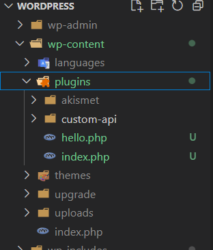

# 1- Descargar e instalar WordPress
```
url: https://wordpress.org/download/releases/6-7/
```

# 2- Abrir el proyecto con VS Code
1- Abrir con VS Code, la carpeta donde esta instalado wordpress
    Ejemplo: C:\xampp\htdocs\wordpress
2- Buscar la carpeta wp-content > plugins
3- Colocar la carpeta 'custom-api' de este repo, junto con su archivo custom-api.php

